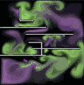

# web-fluids-app

Jos Stam's famous fluid solver

## References

### General
- https://github.com/HollowaySean/FluidSimulator
- https://github.com/Robinseibold/two-dimensional-smoke-simulation
- https://github.com/som1990/2DEularianFluidSimulation
- https://github.com/woeishi/StableFluids
- https://developer.download.nvidia.com/presentations/2010/gdc/Taking_Fluid_Simulation_Out_of_the_Box_Particle_Effects_in_Dark_Void.pdf
- https://github.com/983/Fluid-Simulation
- https://www.wdv.com/Aerospace/Fluids/StamFluidsforGames.pdf

### CPU
- https://github.com/NiallHornFX/StableFluids3D-GL

### GPU

- [WebGL Fluid Simulator](https://github.com/PavelDoGreat/WebGL-Fluid-Simulation)
- [PixelFlow](https://github.com/diwi/PixelFlow) collection
- https://github.com/Scrawk/GPU-GEMS-2D-Fluid-Simulation : Unity
- https://github.com/Scrawk/GPU-GEMS-3D-Fluid-Simulation : Unity
- https://github.com/MatiasPiispanen/SmokeVision
